# 🍷 Vinheria Agnello IoT Monitor: Adega Inteligente 🌡️💧💡

<p align="center">
  
</p>

**Tagline:** _Monitoramento em tempo real de temperatura, umidade e luz para garantir a qualidade perfeita dos seus vinhos._

---

<p align="center">
  
  
  
  
  
</p>

---

## 📖 Sobre o Projeto

O **Vinheria Agnello IoT Monitor** é um sistema inteligente projetado para monitorar as condições ambientais cruciais dentro de uma adega de vinhos. Utilizando um microcontrolador **ESP32** conectado a sensores de **temperatura e umidade (DHT11/DHT22)** e **luminosidade (LDR)**, o sistema coleta dados vitais em tempo real.

**Por que isso é importante?** A qualidade e o envelhecimento do vinho são extremamente sensíveis a variações de temperatura, umidade e exposição à luz. Manter essas condições estáveis é essencial para preservar o sabor, o aroma e as propriedades da bebida.

**Como funciona?**

1.  O **ESP32** lê os dados dos sensores.
2.  Conecta-se à rede **Wi-Fi** local.
3.  Envia os dados (com timestamp) para um servidor central (Broker MQTT) usando o protocolo leve **MQTT**.
4.  Um **aplicativo backend em Python** (usando Flask e Paho-MQTT) "escuta" essas mensagens do Broker MQTT.
5.  O backend processa os dados e os envia em tempo real para um **dashboard web**, permitindo a visualização fácil e imediata das condições da adega.

Este projeto foi desenvolvido como parte das atividades acadêmicas na **FIAP**, demonstrando a aplicação prática de conceitos de Internet das Coisas (IoT), comunicação de rede, desenvolvimento de hardware embarcado (ESP32/Arduino) e backend (Python/Flask).

---

## ✨ Funcionalidades Principais

- 🌡️ **Leitura de Temperatura e Umidade:** Utiliza o sensor DHT11 ou DHT22 para medições precisas.
- 💡 **Leitura de Luminosidade:** Usa um sensor LDR para monitorar a intensidade da luz.
- 📶 **Conectividade Wi-Fi:** O ESP32 conecta-se à rede local para enviar os dados.
- 📡 **Comunicação MQTT:** Envio eficiente dos dados dos sensores para um broker MQTT central.
- 🕒 **Timestamping:** Cada leitura de sensor inclui data e hora exatas.
- 🐍 **Backend Python/Flask:** Recebe os dados via MQTT, processa e disponibiliza para o frontend.
- 📊 **Dashboard Web em Tempo Real:** Interface simples (criada com Flask e Socket.IO) que exibe os dados dos sensores instantaneamente no navegador.
- ✨ **Conversão para Porcentagem:** A luminosidade é convertida e exibida em um formato intuitivo de porcentagem (0-100%).

---

## 📸 Telas (Exemplos)

- **Montagem no Wokwi:** Visualização da conexão dos componentes na simulação.
  
- **Dashboard Web:** Como os dados são exibidos no navegador.
  

> **Nota:** Substitua as URLs de exemplo (`https://i.imgur.com/...`) pelos links das suas próprias imagens.

---

## 🛠️ Tecnologias Utilizadas

| Categoria       | Tecnologia                                                                                                                                                                                                                                                                                                                    | Descrição                                                            |
| :-------------- | :---------------------------------------------------------------------------------------------------------------------------------------------------------------------------------------------------------------------------------------------------------------------------------------------------------------------------- | :------------------------------------------------------------------- |
| **Hardware**    |                                                                                                       | Microcontrolador com Wi-Fi e sensores de ambiente.                   |
| **Firmware**    |                                                                                                                                                                                                                                   | Código embarcado no ESP32 para leitura e envio de dados.             |
| **Comunicação** |                                                                                                                                                                                         | Protocolo para envio de dados IoT e conexão de rede sem fio.         |
| **Backend**     |     | Recebe dados via MQTT e os serve para o dashboard web em tempo real. |
| **Simulação**   |                                                                                                                                                                                                                                                                | Plataforma online para simular o circuito e o código do ESP32.       |

---

## 🏗️ Arquitetura Simplificada

O fluxo de dados no sistema é o seguinte:

1.  **Sensores (DHT & LDR)** capturam os dados do ambiente.
2.  O **ESP32** lê os sensores, adiciona um timestamp e publica os dados via **MQTT**.
3.  O **Broker MQTT** (um servidor na nuvem, como HiveMQ ou Mosquitto) recebe os dados.
4.  O **Backend Python (Flask)**, que está inscrito no tópico MQTT, recebe os dados do broker.
5.  O Backend envia os dados via **Socket.IO** para o navegador do usuário.
6.  O **Dashboard Web** (HTML/JavaScript no navegador) exibe os dados em tempo real.


# 🌡️💧💡 IoT com ESP32 + MQTT + Flask + Dashboard Web

## 📊 Visão Geral do Projeto

O projeto conecta sensores físicos a um **ESP32**, que envia dados via **MQTT** para um **Backend Python/Flask**, exibindo as leituras em tempo real em um **Dashboard Web**.

### 🔗 Fluxo de Comunicação

```mermaid
graph LR;
    Sensores[🌡️💧💡 Sensores DHT/LDR] -->|Leitura| ESP32[💻 ESP32];
    ESP32 -->|Wi-Fi| BrokerMQTT[☁️ Broker MQTT];
    BrokerMQTT -->|Subscrição| Backend[🐍 Backend Python/Flask];
    Backend -->|Socket.IO| Dashboard[📊 Dashboard Web];
    Dashboard -->|Visualização| Usuario[👩‍💻 Usuário];

    style Sensores fill:#f9f,stroke:#333,stroke-width:2px;
    style ESP32 fill:#ccf,stroke:#333,stroke-width:2px;
    style BrokerMQTT fill:#fcf,stroke:#333,stroke-width:2px;
    style Backend fill:#ff9,stroke:#333,stroke-width:2px;
    style Dashboard fill:#9cf,stroke:#333,stroke-width:2px;
```



## 🚀 Como Rodar o Projeto (Localmente ou no Wokwi)

Siga estas etapas para testar o projeto.

---

### 🧩 Pré-requisitos

#### Para o ESP32 (Hardware Real ou Wokwi)

- **Hardware:** ESP32 Dev Kit, Sensor DHT11 ou DHT22, Módulo LDR, jumpers, protoboard.  
- **Software (Real):** IDE do Arduino instalada com suporte para ESP32.  
- **Bibliotecas Arduino:**  
  - PubSubClient  
  - DHT sensor library (Adafruit)  
  - ArduinoJson  
- **Conta Wokwi (Simulação):** Gratuita em [wokwi.com](https://wokwi.com)

#### Para o Backend (Python)

- **Python:** versão 3.7+ (baixe em [python.org](https://www.python.org))  
- **pip:** gerenciador de pacotes do Python (já incluso normalmente)

---

### 🧪 Opção 1: Simulação com Wokwi (Mais Fácil)

1. **Abra o Wokwi:** Crie um novo projeto ESP32.  
2. **Adicione Componentes:** DHT22 e LDR Module.  
3. **Faça as Conexões:**

   | Componente | Pino ESP32 | Descrição |
   |-------------|------------|------------|
   | 3V3 | Linha + | Alimentação positiva |
   | GND | Linha - | Terra |
   | DHT22 Data | D15 | Dados de temperatura e umidade |
   | LDR AO | D35 | Leitura de luminosidade |


### Adicione os Arquivos de Configuração:

libraries.txt
PubSubClient
Adafruit Unified Sensor
DHT sensor library
ArduinoJson
wokwi.toml

[wokwi]
version = 1
firmware = ".pio/build/esp32dev/firmware.bin" # ou caminho padrão do Wokwi

[conn]
type = "wifi"
ssid = "Wokwi-GUEST"
password = ""

### 🧩 Continuação — Simulação no Wokwi

4. **Cole o Código do ESP32:**  
   Utilize o arquivo `sketch.ino` fornecido (usando **Wokwi-GUEST** e **DHT22**).  
   Certifique-se de ajustar as variáveis **`MQTT_BROKER`** e **`MQTT_TOPIC`** corretamente.

5. **Execute o Backend Python** (veja instruções abaixo).  

6. **Inicie a Simulação:**  
   Clique em ▶️ no Wokwi e verifique o console serial confirmando:  
   - Conexão com Wi-Fi  
   - Conexão com o Broker MQTT  

---

## 🔌 Opção 2: Hardware Real

1. **Monte o Circuito:**  
   Conecte o **ESP32**, **DHT11/DHT22** e **LDR** conforme o diagrama do projeto.

2. **Abra a IDE Arduino:**
   - Cole o código C++ do ESP32.  
   - Altere as variáveis:
     - `WIFI_SSID`
     - `WIFI_PASS`
     - `MQTT_BROKER`
     - `MQTT_TOPIC`
   - ⚙️ Se estiver usando **DHT11**, altere:
     ```cpp
     #define DHT_TYPE DHT22
     ```
     para:
     ```cpp
     #define DHT_TYPE DHT11
     ```

3. **Instale as Bibliotecas:**  
   Pelo **Gerenciador de Bibliotecas** da IDE Arduino:
   - PubSubClient  
   - DHT sensor library  
   - ArduinoJson  

4. **Compile e Grave o Código:**  
   - Conecte o ESP32 via USB  
   - Selecione a placa e a porta corretas  
   - Clique em **“Carregar”**  

5. **Abra o Monitor Serial:**  
   - Verifique se o ESP32 conecta corretamente ao **Wi-Fi** e ao **MQTT**  

6. **Execute o Backend Python:**  
   - Siga as instruções da próxima seção para iniciar o backend.


### 🐍 Executando o Backend Python
**1️⃣ Clone o Repositório**
git clone URL_DO_SEU_REPOSITORIO
cd NOME_DA_PASTA_DO_PROJETO/backend

**2️⃣ (Opcional) Crie um Ambiente Virtual**
python -m venv .venv
# Ativação Windows:
source .venv/Scripts/activate
# Linux/macOS:
# source .venv/bin/activate

**3️⃣ Instale as Dependências**
pip install Flask Flask-SocketIO paho-mqtt

**4️⃣ Verifique o Script Python**
Abra listener.py e confirme que MQTT_BROKER e MQTT_TOPIC estão iguais aos do ESP32.

**5️⃣ Execute o Script**
python listener.py


## 🧭 Acessando o Dashboard

Com o **backend** rodando, abra no navegador:

👉 [http://127.0.0.1:5000](http://127.0.0.1:5000)

Você verá o **dashboard** exibindo em tempo real os valores de:
- 🌡️ **Temperatura**
- 💧 **Umidade**
- 💡 **Luminosidade (%)**

Os dados são atualizados aproximadamente a cada **10 segundos**.

---

## 📡 Tópico MQTT Principal

fiap/vinheria/dados


### 📦 Exemplo de Payload JSON enviado pelo ESP32

```json
{
  "temp": 22.5,
  "hum": 55.1,
  "lum": 75,
  "ts": "2025-10-21T19:30:00Z"
}

```

# ⚠️ Solução de Problemas Comuns

## 🚫 ESP32 não conecta ao Wi-Fi
- Verifique `WIFI_SSID` e `WIFI_PASS`.
- Confirme se o ESP32 está dentro do alcance do roteador.

## 🚫 MQTT Timeout
- Confira `MQTT_BROKER` e `MQTT_PORT` (geralmente 1883).
- Verifique se o Broker MQTT está online (pode usar o **MQTT Explorer**).
- Desative temporariamente o firewall para teste.

## 🚫 Backend não recebe mensagens
- Confirme se o `MQTT_TOPIC` é idêntico no ESP32 e no Python.
- Veja o console serial do ESP32 para confirmar o envio das mensagens.

## 🚫 Dashboard não atualiza
- Verifique se o backend Python está recebendo mensagens MQTT.
- Abra o console do navegador (F12) e veja erros de **Socket.IO** ou **JavaScript**.

## 💡 Luminosidade incorreta
- Verifique se o cálculo da luminosidade está presente no código:

```cpp
ldr_percent = map(ldr_value_raw, 0, 4095, 0, 100);
```

## Confirme que o JSON enviado inclui o campo:

```json
"lum": ldr_percent
```

## 👨‍💻 Desenvolvedor / Contato
**Gabriel Akira Borges Kiyohara — FIAP (1ESPJ)**  
📧 E-mail: gakirakiyohara@gmail.com  
🐙 GitHub: [Gakira06](https://github.com/Gakira06)

**Gustavo Francisco Santos — FIAP (1ESPJ)**  
📧 E-mail: gst.santos01@gmail.com  
🐙 GitHub: [gugasantos24](https://github.com/gugasantos24)

**Mauro Carlos — FIAP (1ESPJ)**

## 📄 Licença
Este projeto foi desenvolvido para fins acadêmicos.  
Uso e modificação são permitidos dentro deste contexto.  
Distribuição ou uso comercial não autorizado é proibido.

© 2025 Gabriel Akira Borges Kiyohara
